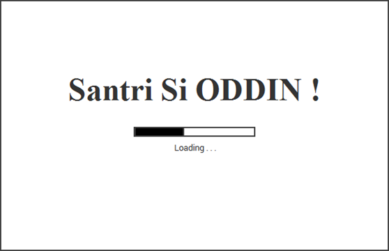
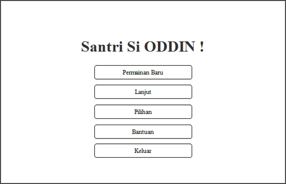
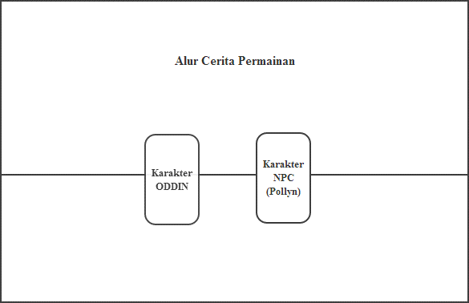
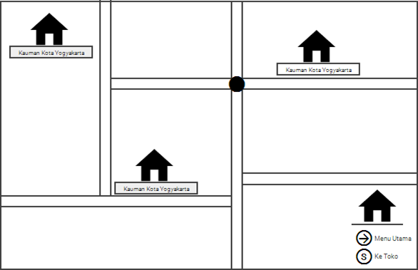
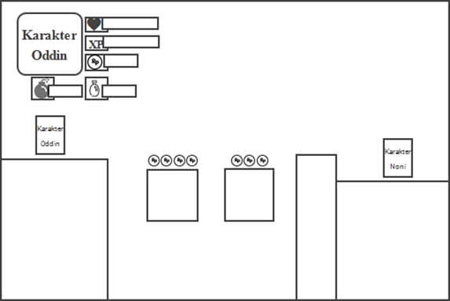
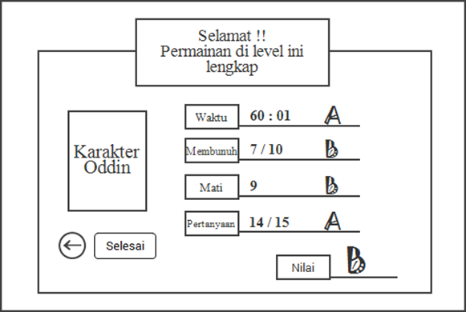
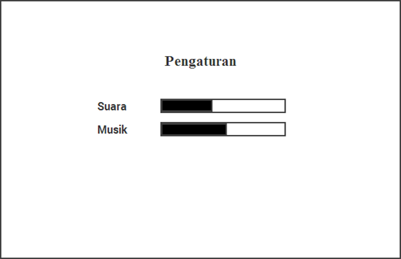
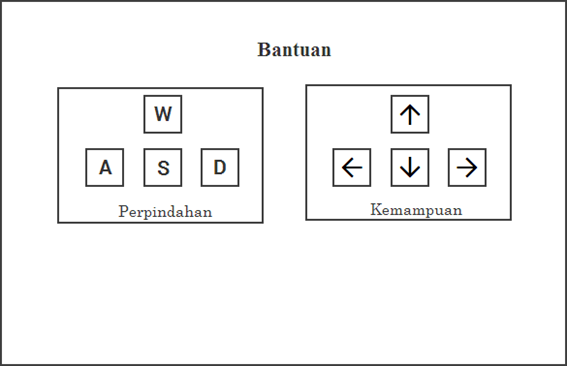
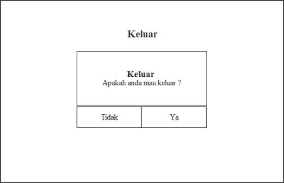
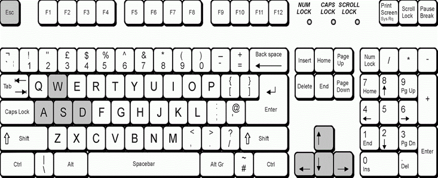

# Sistem Visual

## Layar Splash
Tampilan splash screen merupakan tampilan awal untuk memperkenalkan logo
ketika aplikasi dijalankan. Halaman splash screen ini digunakan sebagai
pembuka aplikasi agar terlihat lebih menarik, dapat dilihat pada Gambar 4.4.
Tampilan Layar Splash.

## Menu Utama
Halaman menu ini menyajikan 5 menu pilihan yang memungkinkan digunakan
oleh pengguna, yaitu menu permainan baru, lanjutan, pilihan, bantuan dan
keluar. Perancangan antarmuka pada menu utama dapat dilihat pada Gambar
4.5. Tampilan Menu Utama.

## Permainan Baru
Pada menu game baru ketika dipilih oleh pengguna, maka pengguna langsung
masuk ke halaman story game. Halaman ini menampilkan informasi cerita
tentang game yang akan dimainkan oleh pengguna, seperti pada Gambar 4.6.
Tampilan Cerita Game.

## Map Menu
Halaman map menu muncul secara otomatis setelah menampilkan story game
selesai. Tampilan map menu berupa peta yang terdiri dari level 1, level 2, level
3 yang harus dimainkan secara berurutan, seperti pada Gambar 4.7. Tampilan
Map Menu.

## Lanjut
Halaman lanjutan ini merupakan tampilan pada map menu yang terdapat level
1, level dan level 3. Pada halaman lanjutan memberikan pilihan untuk
melanjutkan permainan dari level terakhir yang dimainkan oleh pengguna,
seperti pada Gambar 4.8. Tampilan Lanjutan.

## Game Play
Halaman gameplay merupakan tampilan permainan untuk dijalankan oleh
pengguna dengan karakter yang tersedia. Tampilan gameplay memiliki bar
daya kesehatan, bomb, materi dan pertanyaan, sepereti pada Gambar 4.9.
Tampilan Game Play.

## Hasil Akhir
Halaman hasil akhir merupakan penilaian akhir dari pemain yang telah
menjalankan permainan akhir tiap level. Hasil akhir dalam permainan ini
terdiri dari waktu, membunuh, mati, jumlah menjawab pertanyaan dengan
benar, seperti pada Gambar 4.10. Tampilan Hasil Akhir.

## Pilihan
Halaman pilihan ini merupakan tampilan yang menampilkan beberapa pilihan
atribut yang terdapat dalam game untuk mengontrol game yang digunakan,
seperti volume suara, volume musik, seperti pada Gambar 4.11. Tampilan
Pilihan
.

## Bantuan
Halaman ini menampilkan tombol kontrol permainan sebagai cara untuk
menjalankan game terlihat seperti pada Gambar 4.12. Tampilan Bantuan 

## Keluar
Halaman untuk mengakhiri permainan, kemudian pemain diberi dua pilihan
sebelum pemain benar-benar keluar dari permainan, seperti pada Gambar 4.13.
Tampilan Keluar.

# Sistem Kontrol Permainan
Kontrol atau pengendalian merupakan suatu fungsi yang dapat digunakan sebagai
alat untuk mengatur keadaan dari suatu sistem. Dalam permainan ini keyboard
merupakan alat untuk mengatur jalannya permainan, ada beberapa tombol yang
digunakan dalam permainan seperti pada Gambar 4.14. Kontrol Permainan

Setiap tombol pada keyboard memiliki fungsi yang berbeda-beda, dapat dilihat
pada Tabel 4.4. Fungsi Keyboard. 
Tombol	Fungsi Tombol
Tombol W	Tombol untuk melompat
Tombol A	Tombol untuk bergerak ke kiri
Tombol D	Tombol untuk bergerak ke kanan
Tombol S	Tombol untuk membuka peti
Tombol	Tombol	untuk	menyerang	lawan
menggunakan pedang
Tombol	Tombol	untuk	menyerang	lawan
menggunakan bomb
Tombol Esc	Tombol untuk jeda atau pause

# Musik dan Suara
Interaksi dalam perancangan diberikan efek suara berupa suara untuk tombol menu
dan tombol play game. Suara efek diberikan pada aksi-aksi di dalam game play
yaitu ketika pemain melawan musuh dengan menggunakan pedang, melempar
bomb, pemain mendapat koin, pemain melompat dan saat pemain terkena ranjau.
Latar musik diberikan sesuai dengan pengaturan arena seperti di Kauman
Yogyakarta penuh suara asri alam pedesaan, di Jamsaren Surakarta yang hiruk
pikuk dengan banyak kegiatan dan di Tremas Pacitan yang tenang tetapi
mencengkam.
# Sistem Bantuan
Sistem bantuan dalam permainan digunakan sebagai alat bantu yang dapat diakses
dalam menu bantuan.