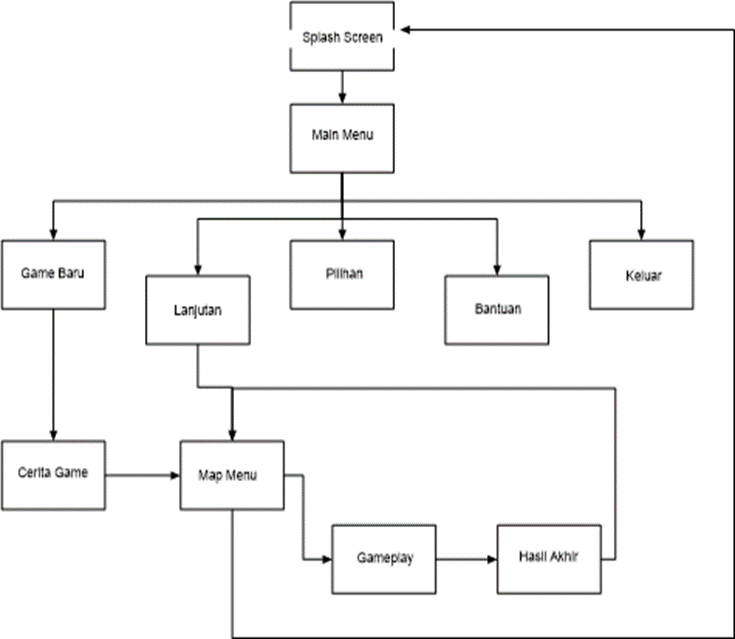

# Game play

## Kemajuan Permainan
 
Pada permainan ini pemain diberi keluasan untuk memainkan permainan
dengan tantangan yang telah ada dan menjawab petanyaan-pertanyaan yang
telah disediakan untuk mendapatkan informasi pengetahuan mengenai sejarah
Biografi Tokoh Pendiri Muhammadiyah.

## Tantangan 
 
 Dalam perancangan permainan ini, tantangan yang harus dihadapi oleh pemain yaitu :

   i. Tantangan pada level pertama yang harus dilakukan oleh pemain, yaitu
pertama pemain harus mengalahkan musuh-musuh yang tersedia, mencari
rangkuman materi dan menjawab pertanyaa-pertanyaan yang sudah
terlampir dengan alur rintangan yang tersedia di dalam level 1.

   ii. Tantangan pada level kedua yang harus dilakukan oleh pemain, yaitu
pertama pemain harus mengalahkan musuh-musuh yang tersedia, mencari
rangkuman materi dan menjawab pertanyaa-pertanyaan dengan alur
rintangan yang tersedia, sama seperti pada level 1, namun dalam level 2
yang membedakan yaitu rintangan pada alur perjalanan ditambah dengan
ranjau duri.

  iii. Tantangan pada level ketiga yang harus dilakukan oleh pemain, yaitu
pertama pemain harus mengalahkan musuh-musuh yang tersedia, mencari
rangkuman materi dan menjawab pertanyaa-pertanyaan dengan alur
rintangan yang tersedia, sama seperti pada level 1 dan 2, namun dalam
level 3 yang membedakan yaitu rintangan pada alur perjalanan ditambah
dengan ranjau sentuh meledak.

## Tujuan Permainan
 
Tujuan dari permainan ini adalah untuk menjawab pertanyaan pada semua level
yang tersedia sebagai sarana pengetahuan sejarah mengenai Biografi Tokoh
Pendiri Muhammadiyah dan memberikan pengalaman baru bagi pemain.

## Play Flow
 
Penerapan teori aliran yang dikembangkan oleh Mihály Csíkszentmihályi akan
di masukkan pada aliran permainan, sebagai titik keseimbangan antara
kemampuan (Skill) dan tantangan (Challenge). Kemudian akan disesuaikan
dengan kemampuan pemain dalam memainkan permainan dengan tujuan untuk
mempertahankan pemain di antara zona kecemasan dan zona kebosanan.
Kemampuan dalam perancangan permainan ini dapat dilihat dari waktu pemain
dalam menjalankan aktivitas permainan seberapa lama. Tantangan dalam
perancangan permainan ini dapat dilihat dari keterampilan pemain menjalankan
kontrol, sehingga seberapa banyak musuh yang pemain selesaikan dengan
rintangan yang tersedia. Pemain menjalankan aktifitasnya dengan waktu yang
singkat sesuai kemampuan, maka tantangan yang harus diselesaikan sesuai
dengan rintangan dan musuh yang tersedia untuk berada di zona aliran.
Permainan dirancang untuk pemain tetap berada di zona aliran ;

   i. Pemain memainkan permainan dimulai dari level pertama dan tidak bisa
      diacak dalam melakukan permainan.

  ii. Kesulitan semakin meningkat saat permainan sedang berlangsung untuk
      dapat melanjutkan ke level selanjutnya.

 iii. Pemain yang baik dapat menghadapi musuh.

  iv. Pemain dapat menyesuaikan kesulitan dalam menjalankan permainan
      berdasarkan kemampuan.

  v. Pemain dapat meminimalkan waktu.

# Mekanika

Aturan permainan yang digunakan oleh pemain yang merupakan bagian proses
kerja untuk berinteraksi antara pemain dengan permainan. Mekanika yang
dirancang dalam permainan ini sebagai berikut :
PC (Playable Character) bergerak dalam bidang 2 Dimensi, menjelajah kota untuk
menyelesaikan tantangan tiap level. Musuh akan muncul di sepanjang jalan pada
setiap kota yang dikunjungi, ketika pemain mencoba untuk memenuhi pencarian
dan pemain harus mengalahkan mereka. Pemain juga dapat menemukan rintangan
yang harus dilalui untuk dapat mendapatkan gelar sebagai seorang santri.
Dengan kemajuan Playable Character menjalankan tantangan setiap levelnya.
tindakan dan peristiwa tersebut akan mendapat pencapaian hasil akhir dari
perjalanan permainan, dimana hasil ahkir permainan berupa skor untuk
mengetahui hasil akhir dari permainan yang telah dijalankan. Adapun adegan
dialog terkait game play yang ditampilkan sebagai alur cerita dari permainan yang
ditampilkan di awal permainan.

1. Fisik
 
Permainan diawali dengan antarmuka yang terdiri dari menu-menu yang
tersedia, seperti Permainan Baru, Lanjutan, Pilihan, Bantuan dan Keluar.
Ketika pemain memilih menu Permainan Baru, maka pemain siap masuk ke
dalam tampilan antarmuka permainan untuk memulai permainan. Ketika
pemain memilih tombol Lanjutan, maka pemain masuk ke dalam tampilan
antarmuka permainan untuk melanjutkan permainan sebelumnya.
Ketika pemain memilih tombol Pilihan, maka pemain masuk ke dalam tampilan
antarmuka yang berisi pengaturan musik, suara. Ketika pemain memilih tombol
bantuan, maka pemain masuk ke dalam tampilan antarmuka yang berisi kontrol
untuk memainkan permainan. Ketika pemain memilih menu keluar, maka
pemain akan keluar dari permainan.

 2. Gerakan Umum
 
Pemain dapat memilih untuk bergerak didalam permainan dengan berjalan dan
melompat. Disetiap jalan, pemain akan menemukan koin untuk bisa
dikumpulkan, bertemu musuh yang harus dikalahkan agar menemukan materi
dan pertanyaan. Pergerakan objek dalam permainan ini dikontrol oleh
Keyboard pada Komputer.
 3. Tindakan
 
Tindakan dalam permainan ini berupa, pemain dapat bergerak ke kiri, ke
kekanan dan melompat dengan arahan keyboard.

 4. Objek
 
 i. Melompat

Pemain dapat membuat karakter di dalam permainan melompat ke atas
untuk menghindari benda berbahaya, mengambil koin ataupun berpindah
ke tempat yang lebih tinggi.

 ii. Bergerak

Pemain dapat membuat karakter di dalam permainan bergerak ke arah
kanan atau arah kiri sesuai dengan arahan kontrol pada keyboard.

 iii. Kesehatan

Karakter pemain di dalam permainan memiliki item kesehatan. Ketika
pemain bertemu musuh maka bar kesehatan pemain akan menurun. Satu
bar kesehatan terdapat 7 kali penurunan kesehatan dan ketika
kesehatannya berkurang maka pemain akan mati namun langsung muncul
kembali ditempat, hanya pengurangan kesehatan di item kesehatan yang
ada. Apabila item kesehatan nol, maka pemain akan mengulang
permainan dari awal seri. Jumlah penurunan dari kesehatan 15 % apabila
pemain terkena musuh.

 5. Ekonomi
 
Permainan ini memiliki aksesoris pemain yang bisa diberikan atau dibeli,
dengan cara :
 i. Dibeli menggunakan koin. Hal ini menjadikan koin berkurang apabila
pemain membeli bomb dan nyawa.

 ii. Hadiah dalam permainan ini diberikan pada akhir level ketika pemain
telah selesai menjalankan permainan, hasilnya berupa diamond.

 6. Aliran Layar
 
Pada perancangan permainan ini dibuat aliran layar untuk mengetahui urutan
proses kerja permainan, seperti pada Gambar 4.1. Flowchart Aliran Layar.
Gambar 4.1. Flowchart Aliran Layar

# Opsi Permainan

Dalam permainan ini pemain dapat mengulang permainan dari level awal yang
tersedia. Setiap pemain harus berhasil melewati musuh dan menjawab pertanyaan
yang tersedia untuk dapat melanjutkan permainan ke level selanjutnya.

# Memutar Ulang dan Menyimpan

 1. Memutar Ulang
 Permainan ini memiliki tingkat kesulitan yang membuat para pemain harus
memiliki kemampuan dan fokus yang tepat untuk menjalankan permainan.
Apabila pemain sulit untuk melewati tantangan dalam permainan ini dan
diakhir level mendapatkan hasil yang kurang memuaskan, maka pemain dapat
mengulang kembali permainan dari level awal.

2. Menyimpan, permainan ini memiliki penyimpanan sederhana diakhir level
permainan. Jika pemain mencoba untuk meninggalkan permainan tanpa
menyelesaikan level, maka kemajuan permainan akan hilang dan permainan
akan menyimpan secara otomatis.