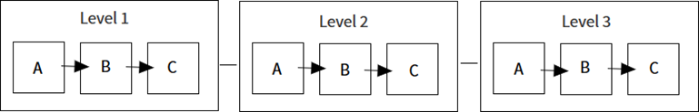
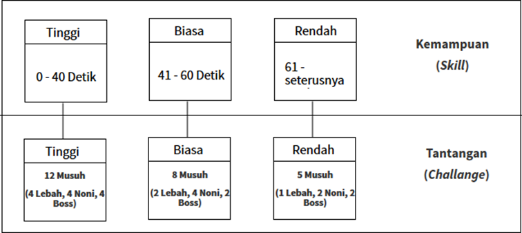

# Diagram Tingkat Permainan
Pemain untuk berada di zona aliran dibutuhkan kemampuan (Skill) berupa waktu
dan tantangan (Challenge) yang harus diselesaikan dari berapa banyak musuh dan
alur rintangan yang dilalui. Dalam permainan ini memiliki tingkatan diagram yang
berbeda-beda tiap levelnya, karena setiap level terdiri dari 3 seri permainan, seperti pada Gambar 4.2. Blok Diagram Tingkatan Permainan.

Untuk menentukan pemain berada pada zona aliran, perancangan ini dilakukan
simulasi menggunakan permainan yang hampir mirip dengan perancangan yang
dilakukan. Berada pada zona aliran, kemampuan dan tantangan pemain dalam
menjalankan permainan harus seimbang, seperti pada Gambar 4.3. Tingkatan
Diagram Teori Aliran.

Pada permainan ini, pemain harus berada di zona aliran dengan kemampuan dan
tantangan yang seimbang. Sebagai simulasi;

## Level Pertama
 
i. Seri A terdiri dari 8 Musuh (2 Lebah, 4 Noni, 2 Boss).
Untuk pemain berada di zona aliran, pada seri A disimulasikan pemain
dapat menyelesaikan permainan dalam waktu 46 detik, sehingga
tantangan yang harus diselesaikan yaitu 8 musuh. Pemain berada di zona
aliran tingkat biasa dan hasil simulasi digunakan sebagai acuan dalam
permainan seri B.

ii. Seri B, terdiri dari 8 Musuh ( 2 Lebah, 4 Noni, 2 Boss)
Untuk pemain berada di zona aliran, pada seri B disimulasikan pemain
dapat menyelesaikan permainan dalam waktu 51 detik, sehingga
tantangan yang harus diselesaikan yaitu 8 musuh. Pemain berada di zona
aliran dengan tingkatan biasa dan hasil simulasi digunakan sebagai acuan
dalam permainan seri C.

iii. Seri C, terdiri dari 8 Musuh ( 2 Lebah, 4 Noni, 2 Boss)
Untuk pemain berada di zona aliran, pada seri C disimulasikan pemain
dapat menyelesaikan permainan dalam waktu 63 detik, sehingga
tantangan yang harus diselesaikan yaitu 5 Musuh (1 Lebah, 2 Noni, 2
Boss). Pemain berada di zona aliran dengan tingkatan rendah dan hasil
simulasi digunakan sebagai acuan dalam level selanjutnya.

## Level Kedua

i. Seri A, terdiri dari 5 Musuh (1 Lebah, 2 Noni, 2 Boss)
Untuk pemain berada di zona aliran, pada seri A disimulasikan pemain
dapat menyelesaikan permainan dalam waktu 37 detik, sehingga
tantangan yang harus diselesaikan yaitu 12 Musuh (4 Lebah, 4 Noni, 4
Boss). Pemain berada di zona aliran dengan tingkatan tinggi dan hasil
simulasi digunakan sebagai acuan dalam seri B.

ii. Seri B, terdiri dari 12 Musuh (4 Lebah, 4 Noni, 4 Boss)
Untuk pemain berada di zona aliran, pada seri B disimulasikan pemain
dapat menyelesaikan permainan dalam waktu 89 detik, sehingga
tantangan yang harus diselesaikan yaitu 5 Musuh (1 Lebah, 2 Noni, 2 
Boss). Pemain berada di zona aliran dengan tingkatan rendah dan hasil
simulasi digunakan sebagai acuan dalam seri C.

iii. Seri C, terdiri dari 5 Musuh (1 Lebah, 2 Noni, 2 Boss)
Untuk pemain berada di zona aliran, pada seri C disimulasikan pemain
dapat menyelesaikan permainan dalam waktu 61 detik, sehingga
tantangan yang harus diselesaikan yaitu 5 Musuh (1 Lebah, 2 Noni, 2
Boss). Pemain berada di zona aliran dengan tingkatan rendah dan hasil
simulasi digunakan sebagai acuan dalam level selanjutnya.

## Level Ketiga

i. Seri A level 3, terdiri dari 5 Musuh (1 Lebah, 2 Noni, 2 Boss)
Untuk pemain berada di zona aliran, pada seri A disimulasikan pemain
dapat menyelesaikan permainan dalam waktu 59 detik, sehingga
tantangan yang harus diselesaikan yaitu 8 Musuh ( 2 Lebah, 4 Noni, 2
Boss). Pemain berada di zona aliran dengan tingkatan biasa dan hasil
simulasi digunakan sebagai acuan dalam seri B.

ii. Seri B, terdiri dari 8 Musuh ( 2 Lebah, 4 Noni, 2 Boss).
Untuk pemain berada di zona aliran, pada seri A disimulasikan pemain
dapat menyelesaikan permainan dalam waktu 45 detik, sehingga
tantangan yang harus diselesaikan yaitu 8 Musuh ( 2 Lebah, 4 Noni, 2
Boss). Pemain berada di zona aliran dengan tingkatan biasa dan hasil
simulasi digunakan sebagai acuan dalam seri C.

iii. Seri C, terdiri dari 8 Musuh ( 2 Lebah, 4 Noni, 2 Boss)
Untuk pemain berada di zona aliran, pada seri A disimulasikan pemain
dapat menyelesaikan permainan dalam waktu 40 detik, sehingga
tantangan yang harus diselesaikan yaitu 12 Musuh (4 Lebah, 4 Noni, 4
Boss). Pemain berada di zona aliran dengan tingkatan biasa dan hasil
simulasi digunakan sebagai acuan dalam seri C.

Simulasi diatas didapatkan dari observasi menggunakan permainan yang
hampir mirip dengan permainan yang dirancang ini, sehingga didapatkan
waktu yang bisa digunakan sebagai acuan untuk pemain berada di zona aliran.

# Pengaturan Aset
 - Pedang, dalam permainan ini digunakan sebagai pelindungan diri dari musuh.
Pedang dapat berubah dengan cara menukarkan koin untuk bisa mendapatkan
pedang yang lebih bagus dan kekuatan akan bertambah.
 - Koin, dalam permainan ini untuk mendapatkan koin, pemain harus berjalan
atau melompat dan mendekati koin sesuai dengan penempatan koinnya pada
permainan. Skor koin bertambah 1 apabila pemain bisa mendapatkan koin
sesuai posisinya. Koin dapat digunakan untuk membeli bomb, nyawa,
mengubah pedang sebagai senjata untuk mengalahkan musuh.
 - Bomb, dalam permainan ini untuk mendapatkan bomb, pemain harus
mengalahkan musuh noni dan boss. Setelah musuh mati maka bomb akan
muncul sebagai hadiah dan pemain harus berjalan mendekati bomb untuk
mendapatkan bomb tersebut. Pemain juga bisa mendapatkan bomb dengan
membeli ke toko menggunakan koin yang diperolehnya. 
 - Peti Tertutup, dalam permainan ini untuk mendapatkan peti tertutup, pemain
harus mengalahkan musuh dan melewati ranjau yang sudah tersedia. Apabila
peti sudah didapatkan, pemain harus membaca rangkuman materi tentang
Biografi Tokoh Pendiri Muhammadiyah agar bisa menjawab pertanyaan di peti
dokumen.
 - Peti Terbuka, dalam permainan ini setelah materi muncul atau dibaca,
kemudian peti langsung terbuka untuk menandakan bahwa materi sudah dibaca.
 - Peti Dokumen, dalam permainan ini untuk mencapai peti terbuka, pemain harus
mengalahkan musuh, melewati ranjau yang sudah tersedia. Apabila peti sudah
didapatkan, pemain harus menjawab pertanyaan yang sudah tersedia di dalam
peti dengan memilih jawaban piliham ganda A, B, C atau D. pilihlah jawaban
yang menurutnya benar agar dapat melanjutkan permainan.
 - Buku, dalam permainan ini untuk mendapatkan buku, pemain harus
menyelesaikan 3 seri permainan di setiap levelnya, agar skor hasil akhirnya
keluar dan hadiah berbentuk buku akan muncul. Buku nantinya digunakan
sebagai syarat untuk Oddin menjadi seorang seorang santri yang baik.

# Tingkatan Desain
Level pertama adalah di Kauman Kota Yogyakarta dan terdapat 3 seri tahapan
berbeda. Dalam level awal ini mampu menjadi pengantar pemain untuk memainkan
permainan ini. Permainan ini memiliki tingkat kesulitan yang yang berbeda di
setiap serinya dan menjawab pertanyaan agar bisa melanjutkan ke level
selanjutnya. Pada level awal ini sudah terdapat pertarungan boss pertama yang 
memperkenalkan kepada pemain bagaimana konsep strategi yang diperlukan untuk
mengalahkan boss.
Level kedua adalah di Kampung Baru Kota Surakarta juga terdapat 3 seri tahapan
yang berbeda. Dalam level kedua ini muncul musuh baru yang bisa melayang dan
terdapat rintangan ranjau berbentuk duri yang berada di tanah, dipohon ataupun di
dinding yang harus di hindari oleh pemain.
Level ketiga dan terakhir adalah di Wuled Kota Pekalongan dan sama seperti levellevel sebelumnya, level 3 ini terdapat 3 seri tahapan yang berbeda. Pemain berada
pada level yang cukup tinggi dengan keterampilan yang mampu memaksimalkan
permainan. Dalam level terakhir ini terdapat tambahan ranjau berbentuk balok yang
apabila disentuh oleh pemain, ranjau tersebut akan langsung meledak.

# Penilaian
Dalam permainan terdapat hasil akhir penilaian di akhir level permainan. Poin
penilaian akan dibuat untuk mempermudah dalam penilaian dan didapatkan dalam
bentuk penilaian alphabet, seperti pada Tabel 4.2. Poin Penilain.
Membunuh
(x)	Mati (y)	Pertanyaan
Benar (n)	Waktu	Poin
19 – 23	1 – 3	13 - 15	1 - 3 Menit	5
15 – 18	4 – 6	10 – 12	4 - 5 Menit	4
10 – 14	7 – 9	7 – 9	6 - 7 Menit	3
6 – 9	10 – 12	4 – 6	8 - 9 Menit	2
1 – 5	13 dan
seterusnya	1 -3	10 dan
seterusnya	1

Penilaian akan didapat dalam tiap-tiap level permainan dan berikut penjumlahan
untuk mendapatkan nilai akhir permainan, Nilai Akhir = poin x + poin y + poin n
= nilai akhir, contoh ; Nilai Akhir = 5 + 3 + 5 + 3 = 16, jadi nilai akhir yang
didapatkan yaitu berupa abjad B (Baik), seperti pada Tabel 4.3. Nilai Akhir.
| Jumlah Nilai     | Nilai Akhir     |
|------------------|-----------------|
| 18 dan seterunya | A (Sangat Baik) |
| 14 – 17          | B (Baik)        |
| 10 – 13          | C (Cukup)       |
| 6 – 9            | D (Kurang)      |
| 1 – 5            | F (Gagal)       |