## Gambaran Alur Permainan
1. Level 1, Seri A
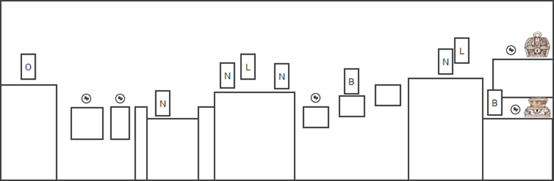

2. Level 1, Seri B
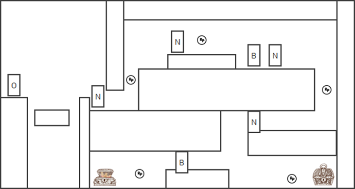

3. Level 1, Seri C
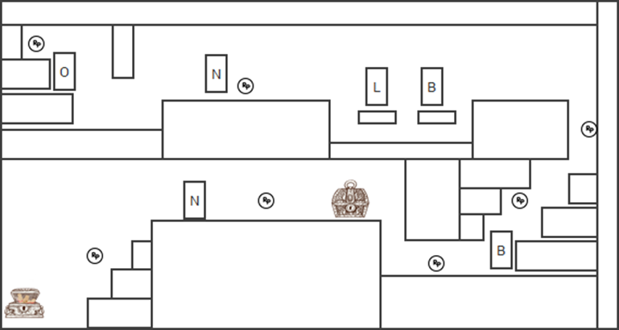

4. Level 2, Seri A
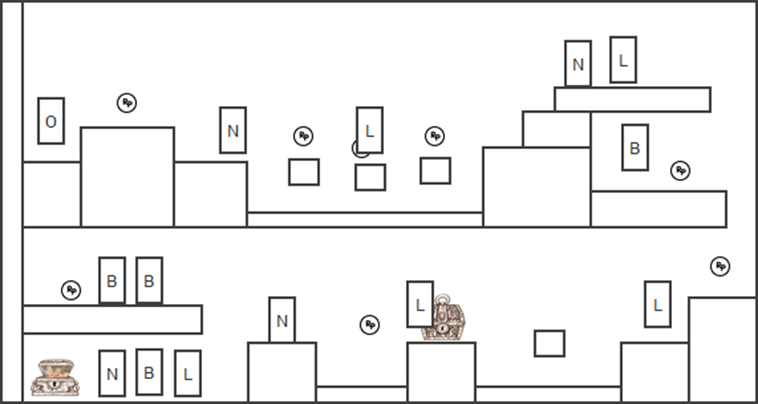

5. Level 2, Seri B
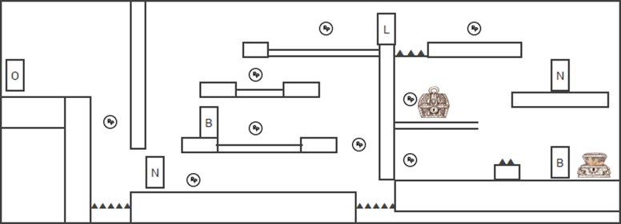

6. Level 2, Seri C
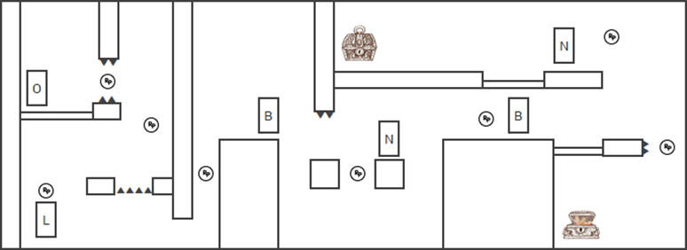

7. Level 3, Seri A
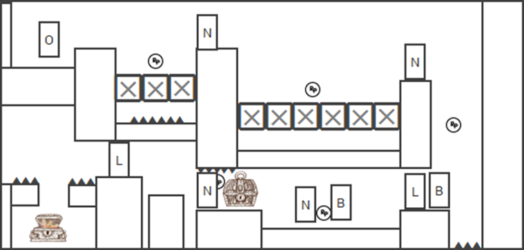

8. Level 3, Seri B
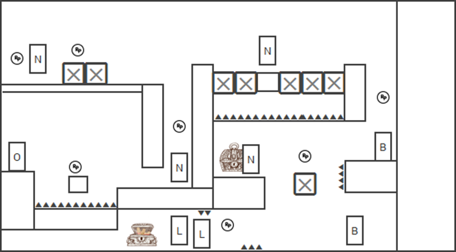

9. Level 3, Seri C
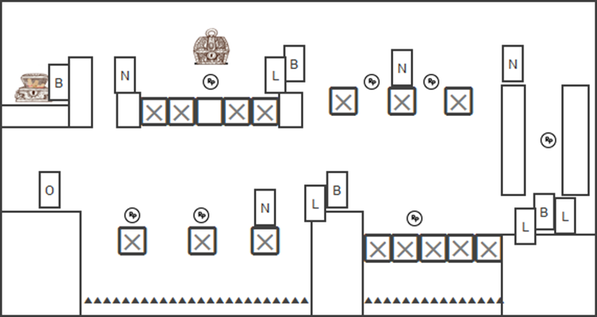

## Storyboard Permainan
Tabel 4.5 Tabel Storyboard

|N0| Storyboard | Keterangan
	
| 1| 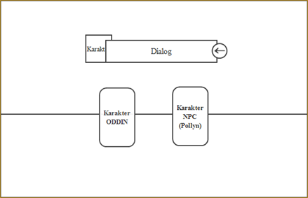 

|Tampilan Cerita Permainan Gambar diatas merupakan tampilan awal ketika pemain masuk ke menu permainan baru.Berisi tentang dialog antara Oddin dan Pollyn (NPC) yang menceritakan bagaimana Oddin bisa untuk menjadi santri.

| 2|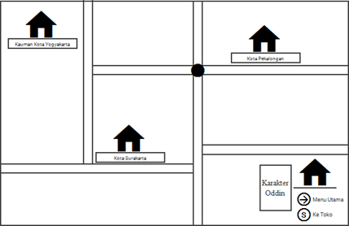

|Tampilan Map	Gambar diatas merupakan tampilan awal map, setelah dialog Oddin dan Pollyn selesai.

| 3| 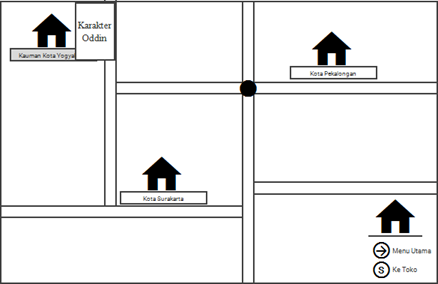

|Tampilan Map, dimana Oddin harus masuk ke Kauman Kota Yogyakarta untuk menyelesaikan misi permainan agar bisa mendapatkan buku dimasing-masing level .

| 4|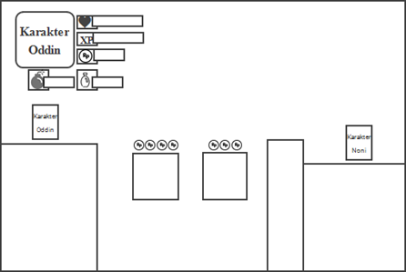

|Gambar diatas merupakan tampilan yang memposisikan bar-bar menu pada permainan Tampilan Menu Bar berada disebelah kanan atas.

| 5| 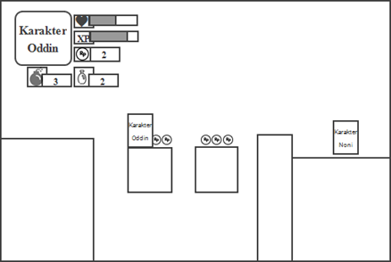 

|Tampilan Oddin Mendapatkan Koin Gambar diatas merupakan tampilan dimana Oddin mendaptkan koin dan poin koin pada menu bar koin akan bertambah.

| 6|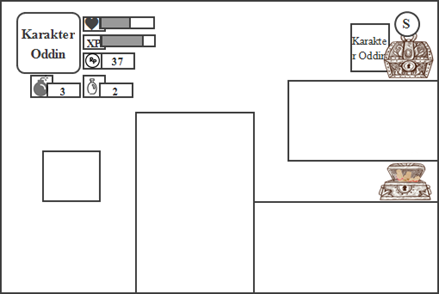 

|Tampilan Peti Rangkuman Materi Gambar diatas merupakan tampilan Oddin menemukan peti tertutup yang berisi materi dari rangkuman Biografi Tokoh Pendiri Muhammadiyah.Untuk membuka peti, pemain harus menekan tombol S pada keyboard agar materi bisa segera dibaca.

| 7| 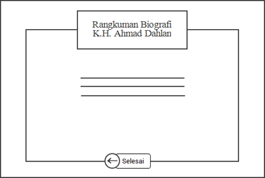 

|Tampilan Rangkuman Gambar diatas merupakan tampilan materi yang berisi rangkuman dari Biografi Tokoh Pendiri Muhammadiyah.

| 8| 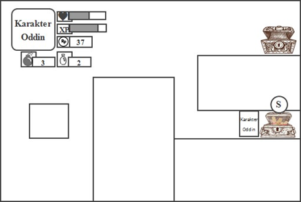 

|Tampilan Peti Pertanyaan Gambar diatas merupakan tampilan Oddin menemukan peti berisi pertanyaan. Untuk membuka pertanyaan pemain harus menekan tombol S pada keyboard agar pemain dapat menjawab pertanyaan yang telah disediakan.

|9 | 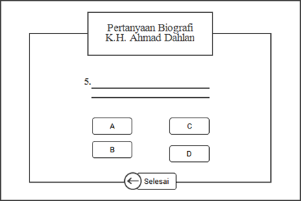 

|Tampilan Pertanyaan Gambar diatas merupakan tampilan dari pertanyaan yang harus dijawab oleh pemain.

| 10| 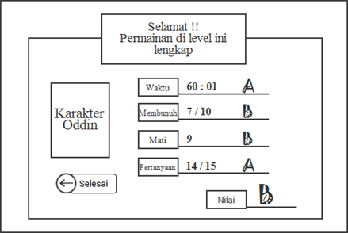 

|Tampilan Hasil Akhir Gambar diatas merupakan tampilan dari hasil akhir yang telah pemain selesaikan dari seri A,B,dan C.

|11 | 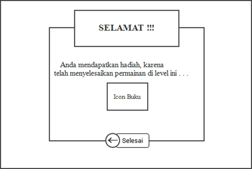 

|Tampilan Hadiah Gambar diatas merupakan tampilan hadiah berupa buku.

|12 | 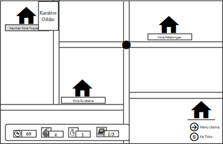 

|Tampilan Map Gambar diatas merupakan tampilan map permainan setelah pemain menyelsaikan level pertama, maka tampilan pada level pertama berubah warna.